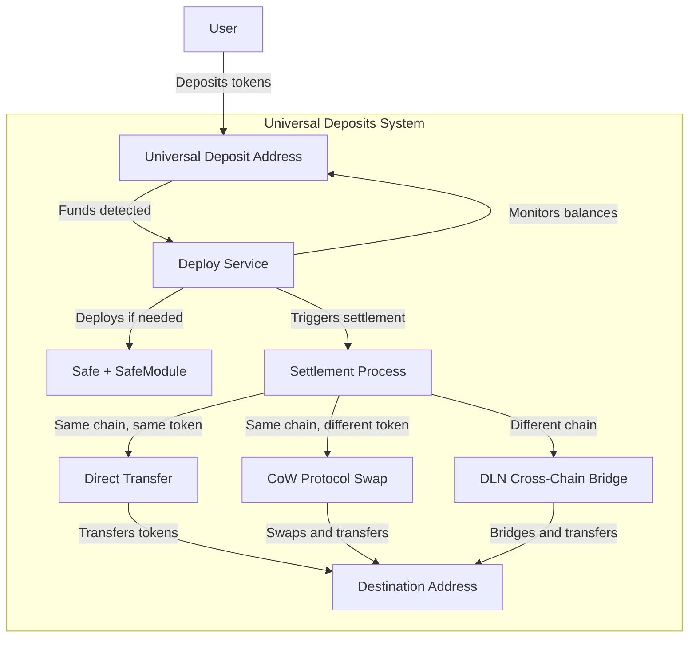
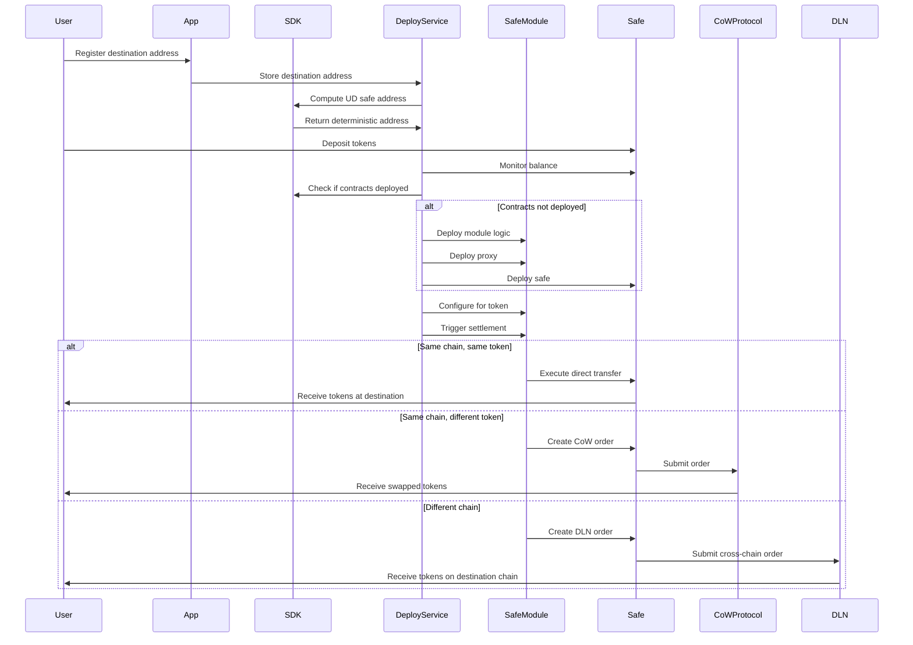
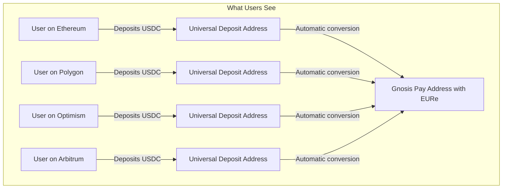
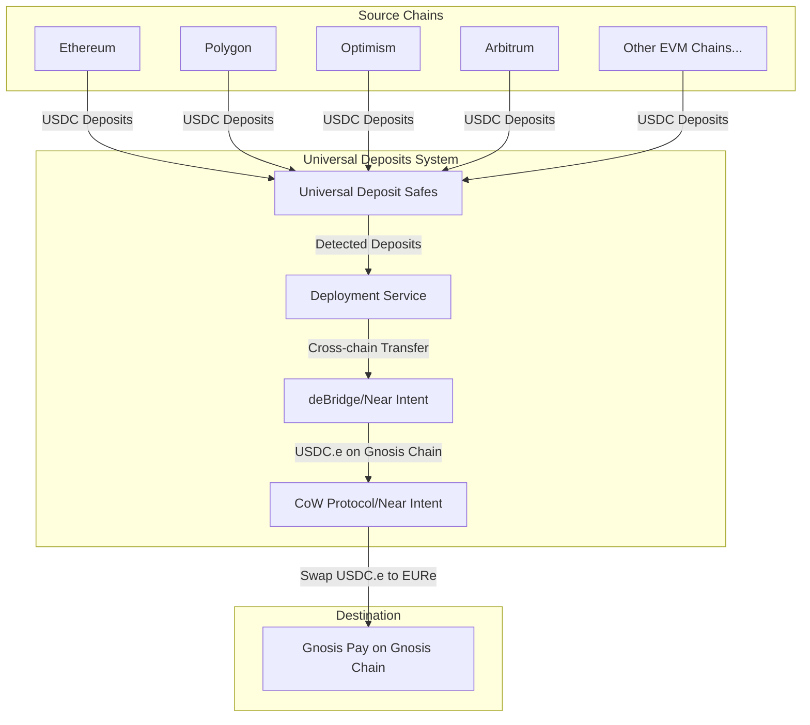

# Universal Deposits

A cross-chain protocol that allows users to deposit tokens on any supported chain and have them arrive at a specified destination address, potentially on a different chain and in a different token.

## Overview

Universal Deposits creates deterministic safe addresses that can receive tokens from any supported chain. When tokens are deposited, the system can automatically:

1. Forward the tokens to a destination address on the same chain
2. Swap the tokens to a different token on the same chain (via CoW Protocol)
3. Bridge the tokens to a different chain (via DLN - Distributed Liquidity Network)

## Architecture

The project consists of four main packages:

### @universal-deposits/contracts (evm)

Contains the Solidity smart contracts that power the Universal Deposits system:

- **SafeModule.sol**: Core contract that handles:
  - Token transfers (same token, same chain)
  - Token swaps via CoW Protocol (different token, same chain)
  - Cross-chain transfers via DLN (any token, different chain)
- Uses CREATE2 for deterministic contract deployment
- Integrates with Safe smart accounts (formerly Gnosis Safe)
- Implements UUPS proxy pattern for upgradeability

### @universal-deposits/sdk

TypeScript library for interacting with the Universal Deposits system:

- Address derivation (calculating deterministic addresses)
- Contract deployment monitoring
- Event monitoring (watching for token transfers and settlements)
- Integration with viem for blockchain interactions

### @universal-deposits/deploy-service

Service that monitors and manages Universal Deposits:

- Monitors token balances in Universal Deposit safes
- Automatically deploys contracts when needed
- Executes settlements when tokens are detected
- Submits CoW Protocol orders for token swaps
- Configures cross-chain bridges for DLN transfers

### @universal-deposits/app

Simple web application for user interaction:

- Allows users to register destination addresses
- Provides endpoints for submitting new destination addresses

## Workflow



## Component Interaction



## Implementation Details

- Uses CREATE2 for deterministic contract addresses
- Safe smart accounts for custody of funds
- UUPS proxy pattern for contract upgradeability
- Integrates with CoW Protocol for token swaps
- Integrates with DLN for cross-chain transfers
- Written in TypeScript (SDK and services) and Solidity (contracts)

## How It Works for Users

Universal Deposits makes it simple for anyone to receive EURe on Gnosis Chain in their Gnosis Pay address, regardless of which blockchain they're coming from.



### Example User Scenarios

#### Scenario 1: Arbitrum User

Alice has USDC on Arbitrum and wants to fund her Gnosis Pay account with EURe.

1. Alice gets her Universal Deposit address for her Gnosis Pay account
2. She sends USDC from her Arbitrum wallet to this address
3. The system automatically:
   - Detects her deposit
   - Bridges her USDC from Arbitrum to Gnosis Chain
   - Swaps it for EURe
   - Sends the EURe to her Gnosis Pay address

#### Scenario 2: Polygon User

Bob has USDC on Polygon and wants to fund his Gnosis Pay account with EURe.

1. Bob gets his Universal Deposit address for his Gnosis Pay account
2. He sends USDC from his Polygon wallet to this address
3. The system automatically:
   - Detects his deposit
   - Bridges his USDC from Polygon to Gnosis Chain
   - Swaps it for EURe
   - Sends the EURe to his Gnosis Pay address

#### Scenario 3: Gnosis Chain User

Chris has USDC.e on Gnosis Chain and wants to fund his Gnosis Pay account with EURe.

1. Chris gets his Universal Deposit address for his Gnosis Pay account
2. He sends USDC.e from his Gnosis Chain wallet to this address
3. The system automatically:
   - Detects his deposit
   - Swap his USDC.e to EURe using CowSwap
   - Sends the EURe to his Gnosis Pay address

### System Overview



## Getting Started

### Prerequisites

- Node.js and Yarn
- Foundry for Solidity development
- Access to EVM-compatible blockchain nodes

### Installation

```bash
# Clone the repository
git clone https://github.com/your-org/universal-deposits.git
cd universal-deposits

# Install dependencies
yarn install

# Build the packages
yarn workspaces run build
```

### Configuration

Create a `.env` file in the root directory:

```
# Chain Configuration
ORIGIN_CHAIN=8453
DESTINATION_CHAIN=100
DESTINATION_TOKEN=0xcB444e90D8198415266c6a2724b7900fb12FC56E // EURe

# API Configuration
URL=https://rpc.ankr.com/gnosis
BROADCAST=true
CHECK_FREQUENCY=1000

# Service Configuration
PATH_ADDRESSES=./addresses.txt
PATH_TOKENS=./tokens.txt
PRIVATE_KEY=your_private_key_here
```

### Running the Service

```bash
cd packages/deploy-service
ENV_PATH=.env node src/index.js
```

## Contributing

Contributions are welcome! Please feel free to submit a Pull Request.

## License

This project is licensed under the MIT License - see the LICENSE file for details.
