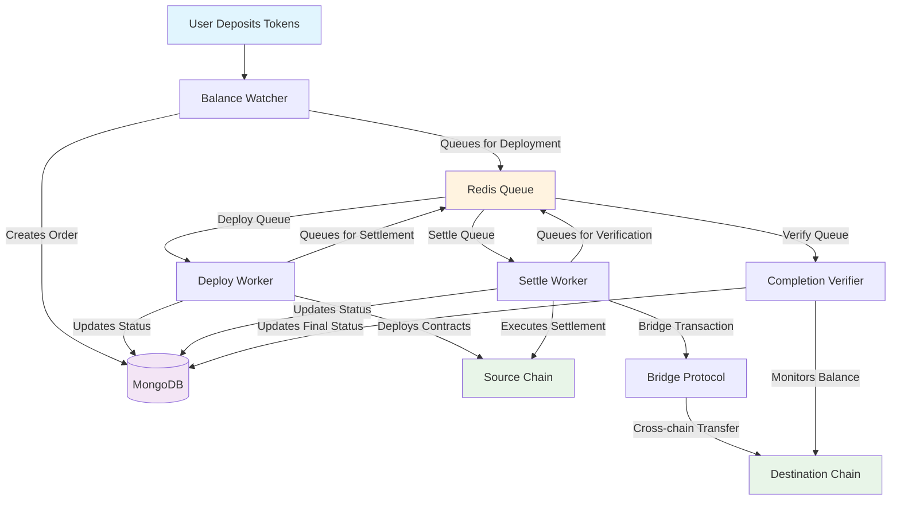
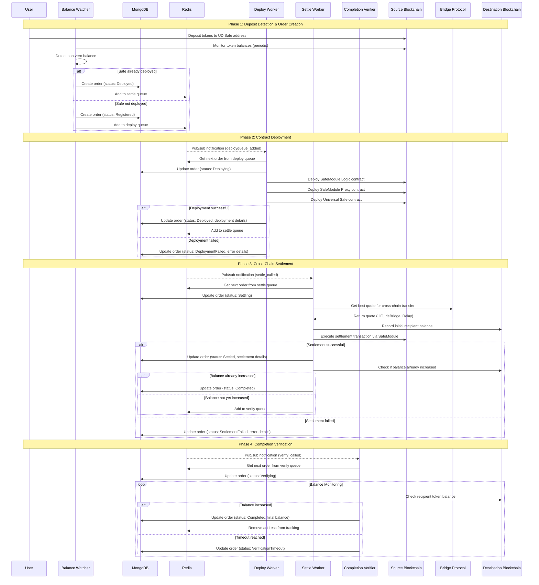
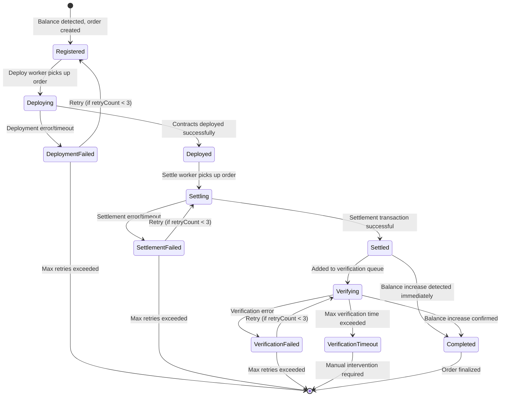
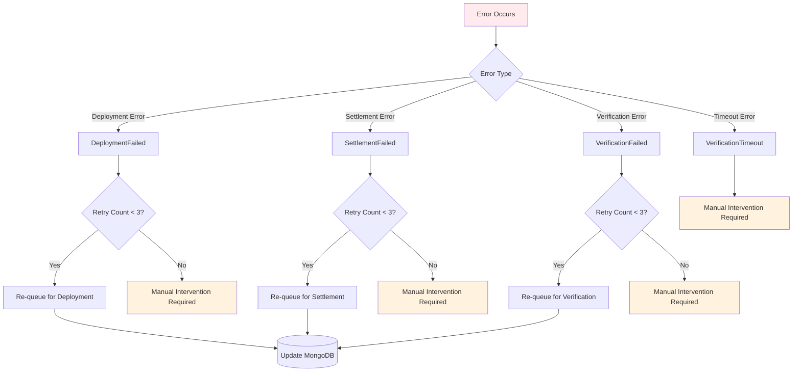

# Universal Deposits Deploy Service

The Universal Deposits Deploy Service is a Node.js microservice that orchestrates cross-chain token deposits and settlements. It monitors token balances on source chains, deploys Safe contracts when deposits are detected, and facilitates settlement transactions on destination chains.

## Overview

This service consists of four main components that work together to provide a complete cross-chain deposit and settlement solution:

- **BalanceWatcher**: Monitors token balances across multiple chains and creates orders
- **DeployWorker**: Handles Universal Safe contract deployment on source chains
- **SettleWorker**: Manages cross-chain settlement transactions using bridge protocols
- **CompletionVerifier**: Verifies transaction completion on destination chains through balance monitoring

## Installation

```bash
npm install
```

## Configuration

Set the following environment variables:

```bash
DEPLOYER_PRIVATE_KEY=your_deployer_private_key
SETTLER_PRIVATE_KEY=your_settler_private_key
INTERVAL=30000  # Service polling interval in milliseconds
LIFI_API_KEY=your_lifi_api_key  # Optional, for LiFi bridge integration
```

## Usage

Start the service:

```bash
npm start
```

The service will initialize all four components and begin monitoring for deposits.

## Workflow Diagrams

### High-Level System Flow



### Detailed End-to-End Sequence



### Order State Machine



### Error Handling Flow



## Database Schema

### MongoDB Collections

#### Orders Collection

```javascript
{
  orderId: String,                    // Primary key, keccak256 hash of order parameters
  orderIdHash: String,                // Same as orderId, for easier querying
  sourceChainId: Number,              // Source blockchain chain ID
  destinationChainId: Number,         // Destination blockchain chain ID (typically 100 for Gnosis)
  recipientAddress: String,           // Ethereum address of the final recipient
  udAddress: String,                  // Universal Deposits Safe address
  sourceToken: String,                // Token contract address on source chain
  destinationToken: String,           // Token contract address on destination chain

  // Order Status Tracking
  status: String,                     // Current order status (see Order States below)
  createdAt: Date,                    // When the order was first created
  updatedAt: Date,                    // Last modification timestamp

  // Phase-specific Timestamps
  deployedAt: Date,                   // When contracts were successfully deployed (nullable)
  settledAt: Date,                    // When settlement transaction completed (nullable)
  completedAt: Date,                  // When final verification completed (nullable)
  verificationStartedAt: Date,        // When verification monitoring began (nullable)
  verificationEndedAt: Date,          // When verification ended (nullable)

  // Error Handling
  lastError: String,                  // Last error message encountered (nullable)
  retryCount: Number,                 // Number of retry attempts made

  // Deployment Details
  deploymentDetails: {                // Contract addresses after deployment (nullable)
    safeModuleLogic: String,          // SafeModule Logic contract address
    safeModuleProxy: String,          // SafeModule Proxy contract address
    universalSafe: String             // Universal Safe contract address
  },

  // Settlement Details
  settleUrl: String,                  // Bridge service tracking URL (nullable)
  settleOption: String,               // Bridge service used (lifi, deBridge, relay) (nullable)
  initialDestinationBalance: String,  // Recipient balance before settlement (nullable)
  finalDestinationBalance: String,    // Recipient balance after completion (nullable)
  balanceIncrease: String             // Amount of balance increase detected (nullable)
}
```

#### Order States

| State                 | Description                                 | Next Possible States                                     |
| --------------------- | ------------------------------------------- | -------------------------------------------------------- |
| `Registered`          | Order created, awaiting deployment          | `Deploying`, `DeploymentFailed`                          |
| `Deploying`           | Contracts being deployed on source chain    | `Deployed`, `DeploymentFailed`                           |
| `Deployed`            | Contracts successfully deployed             | `Settling`, `SettlementFailed`                           |
| `Settling`            | Settlement transaction in progress          | `Settled`, `SettlementFailed`                            |
| `Settled`             | Settlement completed, awaiting verification | `Verifying`, `Completed`                                 |
| `Verifying`           | Balance monitoring in progress              | `Completed`, `VerificationTimeout`, `VerificationFailed` |
| `Completed`           | Order successfully finalized                | _Final state_                                            |
| `DeploymentFailed`    | Deployment encountered an error             | `Registered` (retry), _Terminal_ (max retries)           |
| `SettlementFailed`    | Settlement encountered an error             | `Settling` (retry), _Terminal_ (max retries)             |
| `VerificationFailed`  | Verification encountered an error           | `Verifying` (retry), _Terminal_ (max retries)            |
| `VerificationTimeout` | Verification exceeded time limit            | _Terminal_ (manual intervention required)                |

### Redis Data Structures

#### Queue Management

| Queue Name                                   | Purpose                         | Data Format                                  |
| -------------------------------------------- | ------------------------------- | -------------------------------------------- |
| `universal-deposits:queue:deploy`            | Orders awaiting deployment      | JSON order objects                           |
| `universal-deposits:queue:settle`            | Orders awaiting settlement      | JSON order objects                           |
| `universal-deposits:queue:verify`            | Orders awaiting verification    | JSON order objects                           |
| `universal-deposits:queue:deploy:processing` | Orders currently being deployed | JSON order objects with processing timestamp |
| `universal-deposits:queue:settle:processing` | Orders currently being settled  | JSON order objects with processing timestamp |
| `universal-deposits:queue:verify:processing` | Orders currently being verified | JSON order objects with processing timestamp |

#### Hash Maps

| Key                            | Purpose                                       | Data Format                                                             |
| ------------------------------ | --------------------------------------------- | ----------------------------------------------------------------------- |
| `universal-deposits:addresses` | Maps recipient addresses to UD Safe addresses | `{recipientAddress: JSON.stringify([udSafeAddress, destinationToken])}` |

#### Locks

| Key Pattern         | Purpose                     | TTL                       |
| ------------------- | --------------------------- | ------------------------- |
| `lock:{orderId}`    | Processing locks for orders | 30 seconds (configurable) |
| `monitor:{orderId}` | Balance monitoring locks    | 30 minutes                |

#### Pub/Sub Channels

| Channel                      | Message             | Purpose                                        |
| ---------------------------- | ------------------- | ---------------------------------------------- |
| `universal-deposits:deploy`  | `deployqueue_added` | Notifies Deploy Workers of new orders          |
| `universal-deposits:settle`  | `settle_called`     | Notifies Settle Workers of new orders          |
| `universal-deposits:verify`  | `verify_called`     | Notifies Completion Verifiers of new orders    |
| `universal-deposits:changes` | `address_added`     | Notifies of new address registrations (legacy) |

## Component Details

### BalanceWatcher

**Purpose**: Monitors token balances across supported chains and creates orders when deposits are detected.

**Key Functions**:

- **Balance Monitoring**: Periodically scans token balances for all registered Universal Deposit addresses
- **Order Creation**: Creates new MongoDB orders when non-zero balances are detected
- **Smart Detection**: Checks if contracts are already deployed to determine initial order status
- **Redis Integration**: Reads address mappings from Redis hash and publishes queue notifications

**Configuration**:

- Polling interval: `INTERVAL` environment variable (default: 30 seconds)
- Supported chains: Defined in `@universal-deposits/constants`

**Error Handling**:

- Graceful RPC failures with retry logic
- Database connection error recovery
- Malformed address data handling

---

### DeployWorker

**Purpose**: Deploys Universal Safe contracts and SafeModule contracts on source chains.

**Deployment Process**:

1. **SafeModule Logic**: Deploys the logic contract using CREATE2 via CreateX
2. **SafeModule Proxy**: Deploys proxy contract pointing to logic contract
3. **Universal Safe**: Deploys Safe proxy with SafeModule enabled

**Key Features**:

- **Deterministic Addresses**: Uses CREATE2 for predictable contract addresses
- **Idempotent Deployment**: Checks if contracts already exist before deploying
- **Lock-based Processing**: Prevents duplicate deployments using Redis locks
- **Retry Logic**: Automatic retry for failed deployments (max 3 attempts)

**Error Scenarios**:

- Gas estimation failures
- Transaction revert/timeout
- Contract verification failures
- RPC connectivity issues

---

### SettleWorker

**Purpose**: Executes cross-chain settlements using bridge protocols to transfer tokens to destination chains.

**Settlement Process**:

1. **Quote Retrieval**: Gets best quote from available bridge services (LiFi, deBridge, Relay)
2. **Balance Recording**: Records initial recipient balance on destination chain
3. **Settlement Execution**: Calls `settleWithData` on SafeModule proxy contract
4. **Bridge Integration**: Executes bridge transaction through selected protocol
5. **Immediate Verification**: Checks if balance increased immediately after settlement

**Bridge Services**:

- **LiFi**: Full-featured bridge aggregator with API key support
- **deBridge**: Direct bridge protocol integration
- **Relay**: Fast bridge for supported routes

**Error Handling**:

- Quote retrieval failures
- Settlement transaction simulation failures
- Bridge protocol errors
- Gas estimation issues
- Transaction timeout/revert

---

### CompletionVerifier

**Purpose**: Monitors destination chain balances to confirm successful cross-chain transfers.

**Verification Process**:

1. **Balance Monitoring**: Continuously checks recipient token balance on destination chain
2. **Completion Detection**: Compares current balance with initial balance recorded during settlement
3. **Timeout Handling**: Marks orders as timeout if no balance increase detected within time limit
4. **Lock Management**: Uses monitoring locks to prevent duplicate verification processes

**Configuration**:

- Balance check interval: 15 seconds (default)
- Maximum verification time: 10 minutes (default)
- Retry attempts: 3 maximum

**Verification States**:

- **Active Monitoring**: Interval-based balance checking
- **Completed**: Balance increase confirmed
- **Timeout**: Maximum verification time exceeded
- **Failed**: Error during verification process
