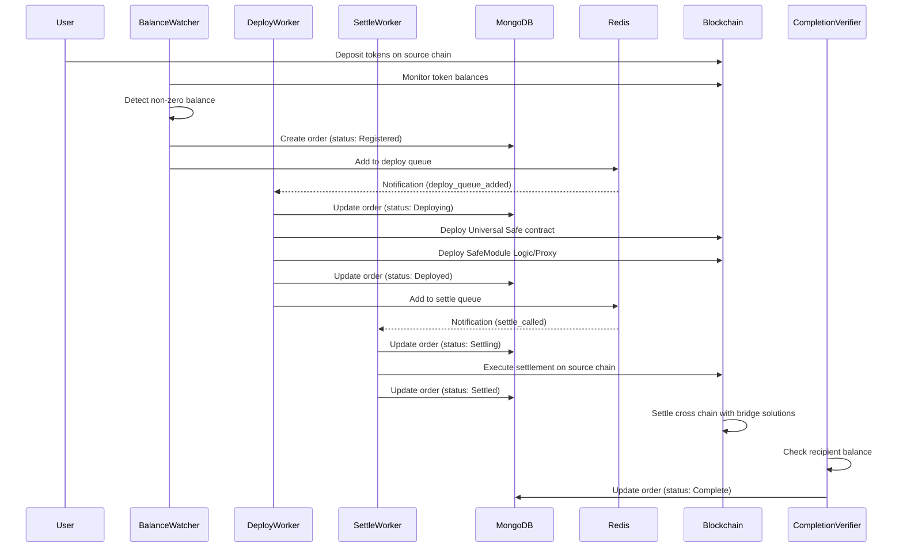

# Universal Deposits Backend Architecture

The Universal Deposits system enables cross-chain token deposits and settlements. It watches for token balances on source chains, deploys safe contracts when deposits are detected, and settles transactions on destination chains.

## Workflow Diagram

The following diagram illustrates the key workflows in the system:



## Database Schema

### MongoDB Collections

#### Orders Collection

```
{
  orderId: String (primary key, keccak256 hash),
  orderIdHash: String,
  sourceChainId: Number,
  destinationChainId: Number,
  recipientAddress: String (Ethereum address),
  udAddress: String (Universal Deposits address),
  sourceToken: String (Token address on source chain),
  destinationToken: String (Token address on destination chain),
  status: String (Registered, Deploying, Deployed, Settling, Settled, DeploymentFailed, SettlementFailed),
  createdAt: Date,
  updatedAt: Date,
  deployedAt: Date (nullable),
  settledAt: Date (nullable),
  lastError: String (nullable),
  retryCount: Number,
  deploymentDetails: Object (deployment transaction details)
}
```

### Redis Data Structures

#### Keys and Data Types

1. **universal-deposits:addresses** - Hash map of recipient addresses to Universal Deposits addresses

#### Pub/Sub Channels

1. **universal-deposits:deploy** - Notifications for deploy queue updates
2. **universal-deposits:settle** - Notifications for settle queue updates
3. **universal-deposits:changes** - Notifications for address added

## Component Interactions

### BalanceWatcher

The BalanceWatcher monitors token balances on supported chains:

- Connects to multiple blockchain networks via the MultiChainClient
- Periodically checks token balances for registered addresses
- Creates new orders in MongoDB when non-zero balances are detected
- Updates order status in both MongoDB and Redis

### DeployWorker

The DeployWorker handles contract deployment on source chains:

- Listens to the deploy queue notifications
- Processes orders with "Registered" status
- Updates order status to "Deploying"
- Deploys Safe contracts and Safe Module using the DeployLogic utility
- Updates order status to "Deployed" upon successful deployment
- Adds deployed orders to the settle queue

### SettleWorker

The SettleWorker handles settlement on destination chains:

- Listens to the settle queue notifications
- Processes orders with "Deployed" status
- Updates order status to "Settling"
- Executes settlement transactions on destination chains
- Updates order status to "Settled" upon successful settlement
- Handles settlement failures

### CompletionVerifier

The CompletionVerifier handles the verification logic on destination chains:

- Check the balance of the order on destination chain once the order status order is to 'Settled'

### MultiChainClient

The MultiChainClient provides blockchain connectivity across multiple chains:

- Initializes wallet and public clients for supported chains
- Provides methods to access chain-specific clients
- Manages RPC URLs and account information
- Supports chain ID validation
